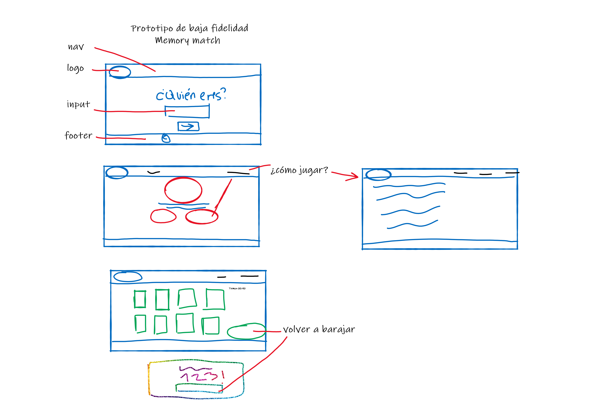
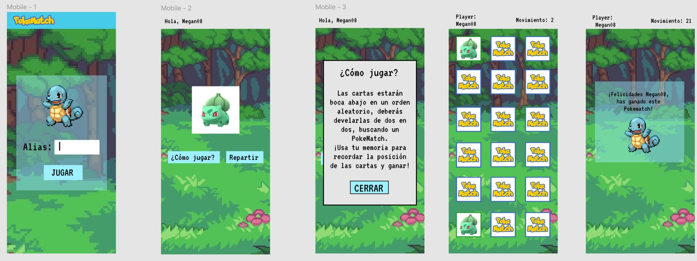
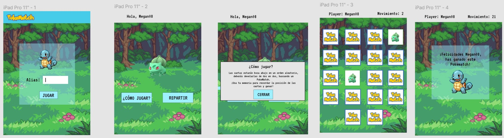
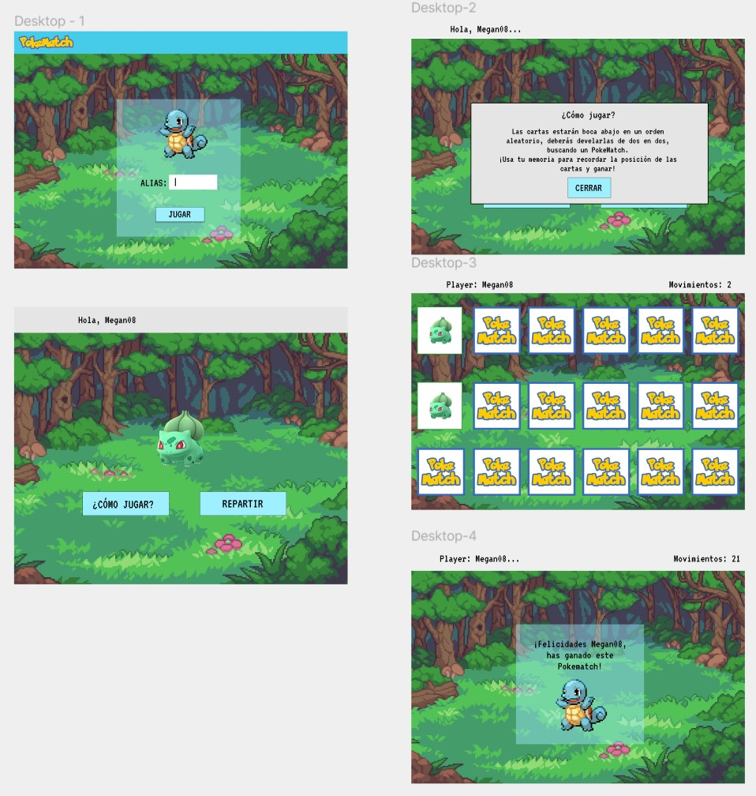

# Memory Match Game

## Índice

* [1. Proceso creativo](#1-proceso-creativo)
* [2. Enfoque de usuario](#2-enfoque-de-usuario)
* [3. Historias de usuario](#3-historias-de-usuario)

***

## 1. Proceso creativo

### Prototipo de baja fidelidad

### Prototipo de alta fidelidad
##### Mobile

##### Tablet

##### Desktop

## 2. Enfoque de usuario

### ¿Quiénes son nuestros usuarios?
- Personas de 10 años a más
- Personas que quieran hacer ejercicios mentales
### ¿Qué necesidad satisface PokeMatch?
Este proyecto de juego de memoria tiene como propósito darle a nuestros usuarios, dentro del grupo demográfico descrito anteriormente, una fuente de
- Diversión
- Relajo
- Ejercicio mental

## 3. Historias de usuario

[Historias de usuario en padlet](https://padlet.com/meg2086/HU)
